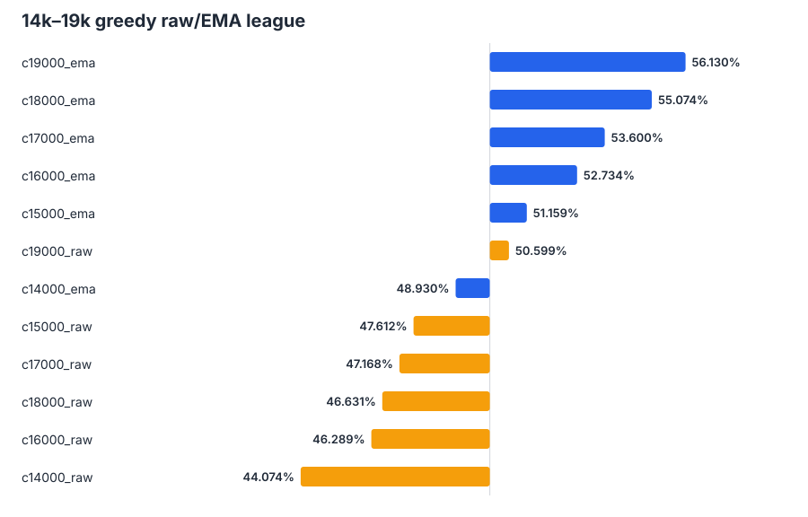
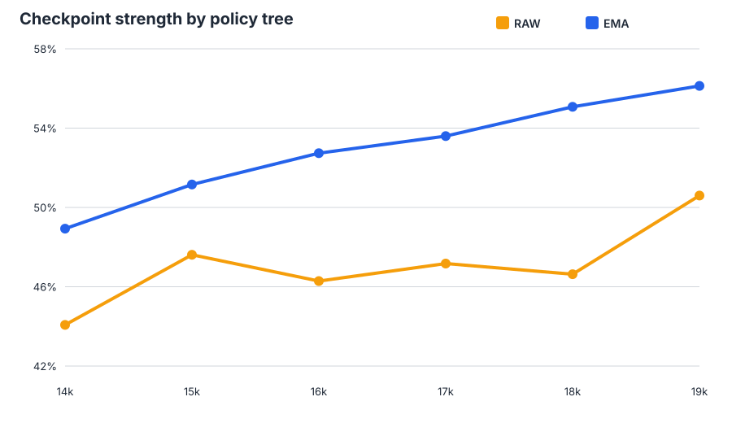

# Greedy raw/EMA checkpoint round robin — 2026-08-07

## Decision

**20k EMA is the strongest established policy from this evaluation.** It beat
the full-league winner, 19k EMA, with a 54.30% score over 1,024 games
(550-462-12; paired-map 95% interval 51.45%-57.14%).

The 20k raw-versus-EMA comparison is unresolved: 20k raw edged 20k EMA with a
51.12% score (517-494-13), but the paired interval includes 50%. If choosing
one policy based on the available evidence, use 20k EMA because it has the
clear direct win over the previously undefeated champion. The data do not
prove that 20k EMA is stronger than 20k raw.

The main 14k-19k round robin contains 66 matchups and 67,584 games. Two 20k
follow-ups add 2,048 games, for **69,632 archived games** in total.

## Main league result

| Rank | Policy | Macro score | W-L-D |
|---:|---|---:|---:|
| 1 | 19k EMA | 56.13% | 6230-4849-185 |
| 2 | 18k EMA | 55.07% | 6105-4962-197 |
| 3 | 17k EMA | 53.60% | 5933-5122-209 |
| 4 | 16k EMA | 52.73% | 5846-5230-188 |
| 5 | 15k EMA | 51.16% | 5673-5412-179 |
| 6 | 19k raw | 50.60% | 5626-5491-147 |
| 7 | 14k EMA | 48.93% | 5423-5664-177 |
| 8 | 15k raw | 47.61% | 5263-5801-200 |
| 9 | 17k raw | 47.17% | 5203-5841-220 |
| 10 | 18k raw | 46.63% | 5136-5895-233 |
| 11 | 16k raw | 46.29% | 5086-5922-256 |
| 12 | 14k raw | 44.07% | 4861-6196-207 |

Because every participant played the same number of games against every other
participant, macro and micro scores are identical.

## How performance changed during training

EMA performance improved monotonically in the balanced league:

| Checkpoint | Raw macro score | EMA macro score | EMA score vs same-checkpoint raw |
|---:|---:|---:|---:|
| 14k | 44.07% | 48.93% | 54.98% |
| 15k | 47.61% | 51.16% | 53.81% |
| 16k | 46.29% | 52.73% | 56.59% |
| 17k | 47.17% | 53.60% | 54.93% |
| 18k | 46.63% | 55.07% | 57.18% |
| 19k | 50.60% | 56.13% | 56.64% |

The raw sequence was not monotonic. It improved from 14k to 15k, plateaued or
regressed across 16k-18k, then recovered at 19k. For example, 15k raw beat
16k raw 53.17% and 18k raw 52.78%, while 17k and 18k raw were almost exactly
tied. In contrast, EMA steadily accumulated strength even when adjacent
EMA-versus-EMA cells were individually close.

The practical EMA advantage was large. EMA beat raw at every same-checkpoint
comparison, with scores from 53.81% to 57.18%. Older EMA policies also remained
competitive with much newer raw weights: 15k EMA tied 19k raw at 50.49%, and
16k EMA tied 19k raw at 50.63%.

## The 19k and 20k frontier

19k EMA went **11-0** in the complete league. Its closest result was a 50.39%
win over 18k EMA; its other ten scores ranged from 53.86% to 60.69%. It beat
19k raw 56.64% (572-436-16).

The requested follow-up used the exact same locked maps:

| Matchup | Score for 20k EMA | W-L-D for 20k EMA | Paired-map 95% interval |
|---|---:|---:|---:|
| 20k EMA vs 20k raw | 48.88% | 494-517-13 | 46.02%-51.74% |
| 20k EMA vs 19k EMA | 54.30% | 550-462-12 | 51.45%-57.14% |

The two results are compatible: 20k raw may be as strong as 20k EMA, while
20k EMA is clearly stronger than 19k EMA. A direct 20k-raw versus 19k-EMA
matchup would be required to rank all three without relying on transitivity.

## Protocol

- Checkpoints 14,000 through 19,000, each using both raw and EMA parameters.
- One connected 12-policy round robin with greedy masked-argmax inference.
- Every matchup contains 1,024 games: 512 locked maps played in both seat
  assignments.
- The two 20k follow-ups reuse the same locked maps and protocol.
- Final competition environment, `competition_39` observations, and 1,200-turn
  truncation.
- Map seed `202608076`; evaluator shards contain 128 maps / 256 games.
- One secure NVIDIA A100-SXM4-80GB. The main league took 3,552 seconds of
  evaluator time; the two 20k matches took 109 seconds.
- Every matchup records W/L/D, paired-map score dispersion and interval,
  runtime, and full behavior counters for both policies.
- Every full training checkpoint was SHA-256 verified before deserialization.

## Interpretation caveats

The overall ranking is descriptive of this participant pool. All matchups use
the same maps, which improves pairwise precision but correlates results across
the matrix. Macro-score gaps therefore should not be treated as independent
confidence intervals. The direct paired-map intervals are the right evidence
for individual head-to-head claims.

The 20k policies were not inserted into the full round robin. They appear only
in the two explicitly requested follow-ups and are not included in the 14k-19k
macro ranking.

## Artifact index

- `round_robin.json` — authoritative complete 66-matchup league, including all
  participants, results, behavior counters, ranking, and score matrix.
- `followup_20k.json` — authoritative two-matchup 20k follow-up.
- `matchups.csv` — flattened data for all 68 matchups and all behavior fields.
- `ranking.csv` and `ranking.svg` — complete-league standings.
- `checkpoint_trend.csv` and `checkpoint_trend.svg` — raw/EMA macro-score trend.
- `same_checkpoint_raw_ema.csv` — direct EMA-versus-raw cells.
- `same_policy_progression.csv` — every raw-to-raw and EMA-to-EMA checkpoint
  comparison with paired intervals.
- `checkpoint_pair_aggregate.csv` — descriptive four-cell aggregate for every
  checkpoint pair.
- `score_matrix.csv` — full 12-by-12 league matrix.
- `followup_20k.csv` — flattened 20k follow-up cells.
- `round_robin.py`, `followup_20k.py`, and `analyze.py` — evaluator and artifact
  generation source.
- `run.log` — complete main-league progress and final ranking.
- `SHA256SUMS` — integrity hashes for the archive.
