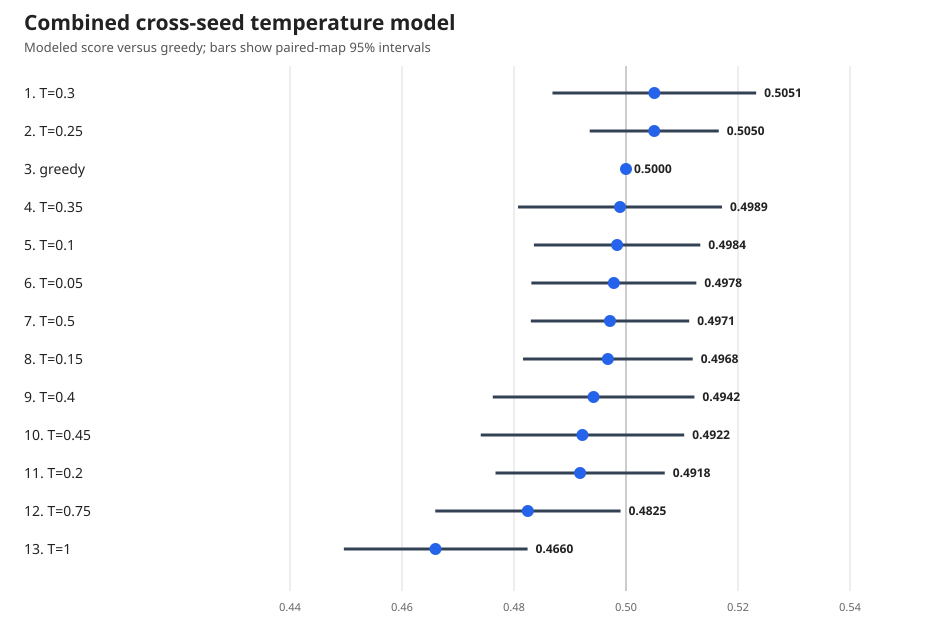

# Checkpoint and inference-temperature evaluation — 2026-08-07

## Decision

Use raw checkpoint 14,000. If submitting a stochastic variant, use categorical
sampling at **temperature 0.25**.

The evidence does not show a statistically sharp optimum between greedy and
the low-temperature policies. The connected cross-seed model estimates T=0.30
at 50.506% versus greedy and T=0.25 at 50.505%; both intervals include 50%.
T=0.25 is the more defensible operational choice because it appeared in all
three complete experiments, ranked first in the 0.25--0.50 fresh-seed sweep,
and beat T=0.30 directly with a 51.03% score. Across two independent map sets,
T=0.25 scored 50.20% against greedy and 51.12% against T=0.50.

The robust negative result is clearer: high-temperature sampling is harmful.
The combined model estimates T=0.75 at 48.25% versus greedy and T=1.0 at
46.60%. Temperature 1.0's paired-map 95% interval is 44.96%--48.24%.

If multiple competition submissions are allowed, retain greedy 14k and submit
T=0.25 as the stochastic alternative. If only one slot is available, T=0.25
is the point-estimate winner but its measured advantage over greedy is
effectively zero; the argument for choosing it is reduced exploitability, not
a demonstrated head-to-head score gain.

## Experiment sequence

| Stage | Policies | Status | Matchups | Games | Outcome |
|---|---:|---|---:|---:|---|
| Checkpoint screen | 10k, 12k, 14k × five inference rules | Stopped after the checkpoint ordering was clear | 33 / 105 | 33,792 | Every completed 12k-vs-10k and 14k-vs-10k cell favored the newer checkpoint |
| 14k coarse temperature | greedy, 0.25, 0.50, 0.75, 1.0 | Complete | 10 / 10 | 10,240 | T=0.50 first; T=0.25 second |
| 14k fine 0.25--0.50 | 0.25 through 0.50 in steps of 0.05 | Complete | 15 / 15 | 15,360 | T=0.25 first; T=0.30 second |
| 14k lower-bound check | greedy through 0.25 in steps of 0.05 | Complete | 15 / 15 | 15,360 | Greedy first; T=0.25 second; all settings within 1.51 points |

The archive contains **74,752 games** in total. The connected 14k temperature
analysis uses the 40 complete matchup records and 40,960 games from the last
three stages.

## Why the checkpoint screen was stopped

The partial screen had already completed 24 cross-checkpoint cells:

- Checkpoint 12k beat 10k in all 14 completed cells, averaging 59.19% with a
  56.45%--62.50% range.
- Checkpoint 14k beat 10k in all 10 completed cells, averaging 62.80% with a
  58.94%--65.87% range.
- A pre-existing raw-greedy evaluation had 14k beating 12k with 56.64% over
  256 games (142--108--6).

The remaining cross-checkpoint games had low decision value, so the GPU was
redirected to fresh-seed 14k temperature comparisons. The 33 completed records
remain preserved under `incomplete_checkpoint_screen/` and are explicitly
marked incomplete.

## Complete 14k results

### Coarse sweep

| Rank | Policy | Macro score | W-L-D |
|---:|---|---:|---:|
| 1 | T=0.50 | 0.5197 | 2091-1930-75 |
| 2 | T=0.25 | 0.5148 | 2067-1946-83 |
| 3 | Greedy | 0.5046 | 2028-1990-78 |
| 4 | T=0.75 | 0.4907 | 1976-2052-68 |
| 5 | T=1.00 | 0.4702 | 1894-2138-64 |

### Fine sweep, T=0.25--0.50

| Rank | Policy | Macro score | W-L-D |
|---:|---|---:|---:|
| 1 | T=0.25 | 0.5162 | 2601-2435-84 |
| 2 | T=0.30 | 0.5076 | 2558-2480-82 |
| 3 | T=0.35 | 0.5003 | 2515-2512-93 |
| 4 | T=0.40 | 0.4946 | 2489-2544-87 |
| 5 | T=0.45 | 0.4923 | 2484-2563-73 |
| 6 | T=0.50 | 0.4890 | 2453-2566-101 |

### Lower-bound sweep, greedy--T=0.25

| Rank | Policy | Macro score | W-L-D |
|---:|---|---:|---:|
| 1 | Greedy | 0.5073 | 2545-2470-105 |
| 2 | T=0.25 | 0.5026 | 2526-2499-95 |
| 3 | T=0.10 | 0.4999 | 2510-2511-99 |
| 4 | T=0.05 | 0.4994 | 2516-2522-82 |
| 5 | T=0.15 | 0.4984 | 2495-2511-114 |
| 6 | T=0.20 | 0.4923 | 2470-2549-101 |

## Protocol

- Raw exported policies from checkpoints 10,000, 12,000, and 14,000.
- Exact final competition environment and `competition_39` observation schema.
- Greedy means masked argmax. Stochastic policies sample categorically from
  the masked policy logits divided by temperature.
- Every matchup contains 1,024 games: 512 locked maps played in both seat
  assignments.
- Evaluation ran on one secure NVIDIA A100-SXM4-80GB with JAX 0.10.2. Each
  compiled evaluator shard contained 128 maps / 256 games.
- Each complete stage uses a different fresh map seed. Within a stage, every
  matchup shares the same map set for lower-variance comparison.
- Every matchup record includes W/L/D, paired-map score dispersion and 95%
  interval, runtime, and full behavior counters for both policies.
- The connected model is inverse-variance weighted least squares on paired-map
  score logits, anchored at greedy. It is descriptive: shared maps correlate
  matchup estimates, and only three independent map sets were used.

## Artifact index

- `combined_temperature_model.json` — connected cross-seed model and repeated
  direct comparisons.
- `combined_temperature_ranking.csv` — compact modeled ranking.
- `combined_temperature_ranking.svg` — publication-ready model chart.
- `repeated_direct_pairs.csv` — comparisons repeated on independent map sets.
- `combined_analysis.py` — exact model-generation script.
- `coarse_14k/`, `fine_025_050/`, and `low_000_025/` — each contains the
  authoritative full JSON, flattened matchup CSV with behavior counters,
  ranking CSV, score matrix, SVG charts, evaluator source, log, and hashes.
- `incomplete_checkpoint_screen/` — all 33 records from the intentionally
  stopped checkpoint screen.
- `SHA256SUMS` — top-level integrity hashes.

## Blog-use caveat

Do not describe T=0.25 as statistically proven optimal. The defensible claim
is that the search rules out high-temperature sampling, finds a broad plateau
from greedy through moderate temperatures, and selects T=0.25 as the most
robust low-temperature operating point from the tested evidence.
