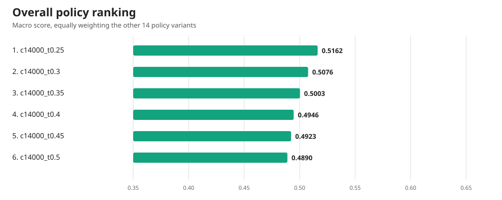
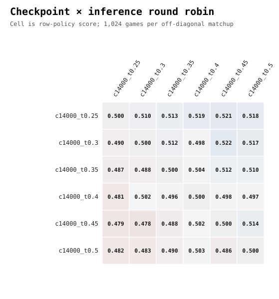

# Greedy versus stochastic checkpoint round robin

## Result

The top policy was **c14000_t0.25** with macro score **0.5162** across the other 14 variants.

## Ranking

| Rank | Policy | Checkpoint | Inference | Temperature | Macro score | W-L-D |
|---:|---|---:|---|---:|---:|---:|
| 1 | c14000_t0.25 | 14,000 | categorical | 0.25 | 0.5162 | 2601-2435-84 |
| 2 | c14000_t0.3 | 14,000 | categorical | 0.3 | 0.5076 | 2558-2480-82 |
| 3 | c14000_t0.35 | 14,000 | categorical | 0.35 | 0.5003 | 2515-2512-93 |
| 4 | c14000_t0.4 | 14,000 | categorical | 0.4 | 0.4946 | 2489-2544-87 |
| 5 | c14000_t0.45 | 14,000 | categorical | 0.45 | 0.4923 | 2484-2563-73 |
| 6 | c14000_t0.5 | 14,000 | categorical | 0.5 | 0.4890 | 2453-2566-101 |

## Protocol

- Three raw checkpoints: 10,000, 12,000, and 14,000.
- Five inference rules per checkpoint: masked argmax and categorical sampling at temperatures 0.25, 0.5, 0.75, and 1.0.
- 15 off-diagonal matchups; 1,024 games per matchup on 512 maps, with both player-seat assignments.
- 15,360 games total.
- The same locked map set was used for every matchup. Map seed: `202608077`; base action seed: `202608078`.
- Each matchup record includes W/L/D, paired-map score dispersion and 95% interval, elapsed time, and complete behavior counters for both policies.
- Macro score equally weights all 14 opponents. Because every matchup contains the same number of games, macro and micro scores are equal up to floating-point rounding.

## Reproducibility

The exact exported weight SHA-256 and parent checkpoint SHA-256 for every participant are embedded in `round_robin.json`. The categorical action key for matchup index `i` was based on `PRNGKey(action_seed + i)` and folded by the shard's starting map index. The evaluator used the final competition environment and observation schema from the checkpoint-14,000 continuation configuration.

## Artifact index

- `round_robin.json` — authoritative full structured result.
- `matchups.csv` — one flattened row per matchup, including all behavior counters.
- `ranking.csv` — compact overall ranking.
- `score_matrix.csv` — row-policy score matrix.
- `ranking.svg` and `score_heatmap.svg` — publication-ready vector charts.
- `round_robin.py` — exact evaluator used on the GPU.
- `run.log` — complete progress log and final printed ranking.
- `SHA256SUMS` — integrity hashes for every artifact.

## Interpretation caveats

This league measures relative performance among these 15 versions, not absolute performance against the external competition field. Pairwise confidence intervals use the paired-map dispersion from the seat-swapped games. Reusing the same locked maps improves comparability across matchups, but means matchup estimates are correlated; do not treat the 105 cells as independent experiments.
